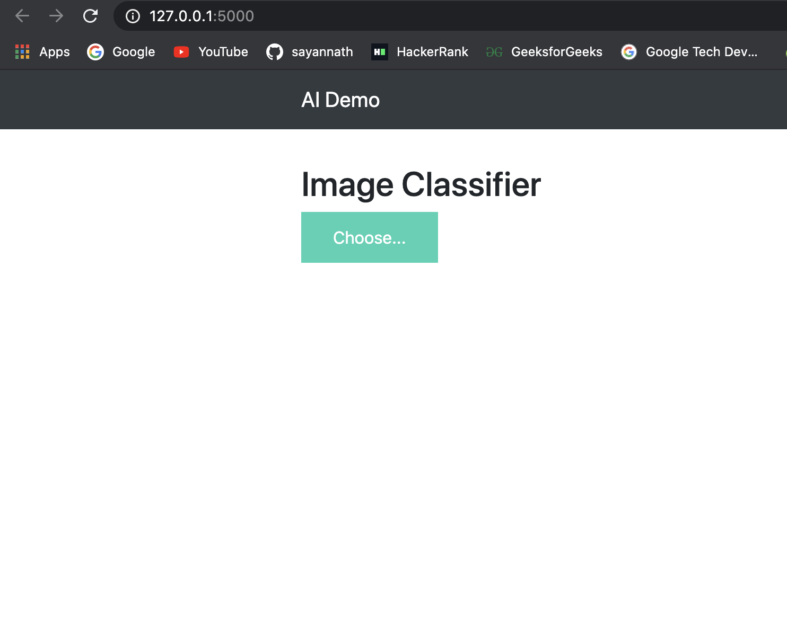
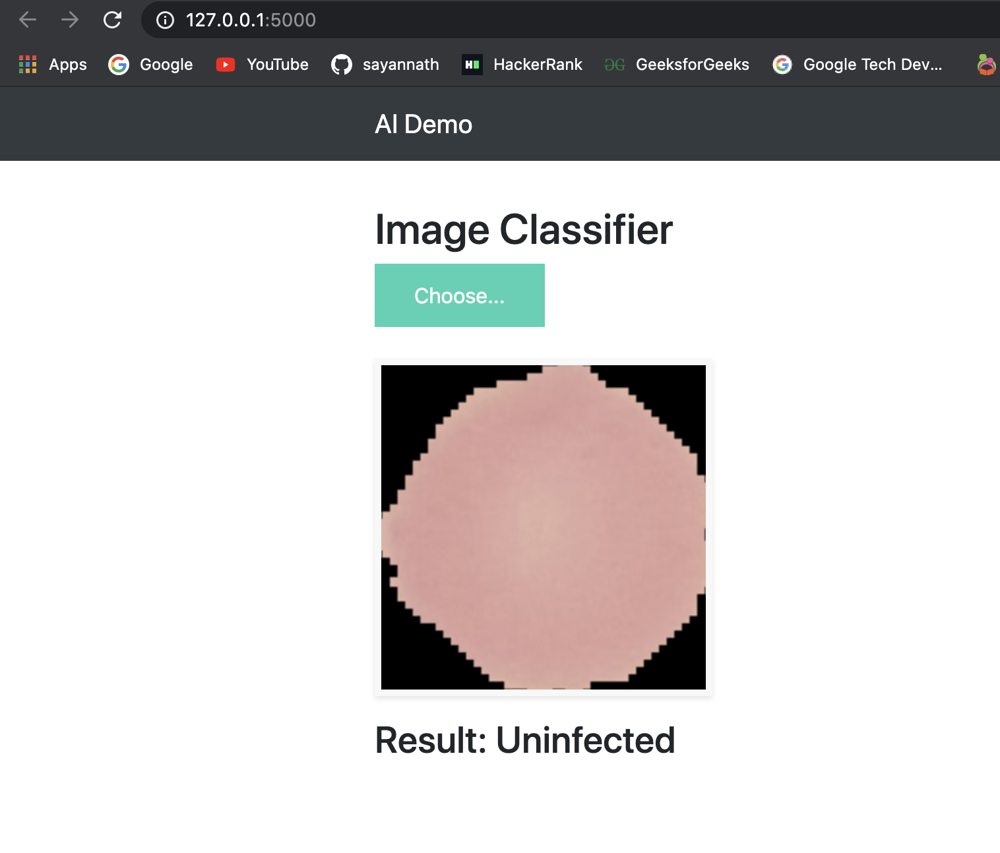
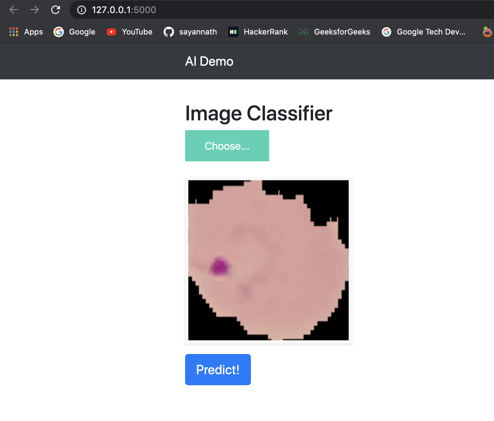
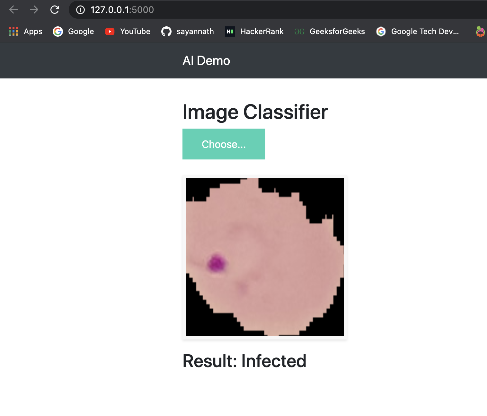

# Malaria Detection 
### Malaria Detection using CNN.

## Short Description
A deep learning model is build to detect malaria of the patients with the cell images of the patients.
<br>

# Dataset:
Dataset Link:- <a href="https://ceb.nlm.nih.gov/repositories/malaria-datasets/">https://ceb.nlm.nih.gov/repositories/malaria-datasets/ </a>
<br>

### 👉 If you like this repo then please give it a ⭐️
<br>

## NOTE:
This project is subject to change by the developer and is still in development
<br>

## Screenshots





<br>
<br>
<br>
## To test this out
Testing this is as simple as it gets. Follow this steps:
1. Clone this project.
2. Open your terminal (NOTE: git bash preferred/ Terminal on VS Code)
3. Type the following command in the terminal
     ```
     cd Website/Malaria-Detection
     pip3 install -r requirements.txt (in Mac or Linux)
     pip install -r requirements.txt (in Windows)
     python3 app.py (in Mac or Linux)
     python app.py  (in Windows)
     ```
4. Visit the localhost to see it in action

## Pull Request

Pull Requests are welcome. Please follow these rules for the ease of understanding:
* Make sure to check for available issues before raising one
* Give me a maximum of 24-48 hours to respond
* Have proper documentation on the parts you are changing/adding


## Developed & Maintained by
<br>

[👨 Sayan Nath](https://sayan-nath.web.app/)


[📷 Insta](https://www.instagram.com/sayannath235/)

[🐤 Twitter](https://twitter.com/SayanNa20204009)

[🧳 LinkedIn](https://www.linkedin.com/in/sayan-nath-15a989182/)
<br>

[](https://github.com/sayannath)
